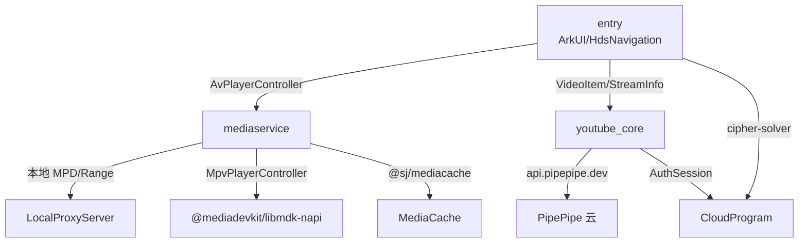
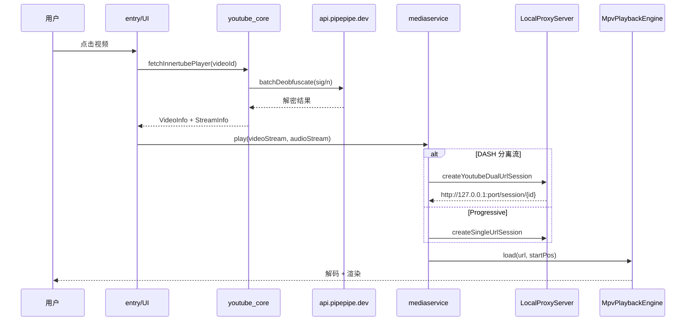
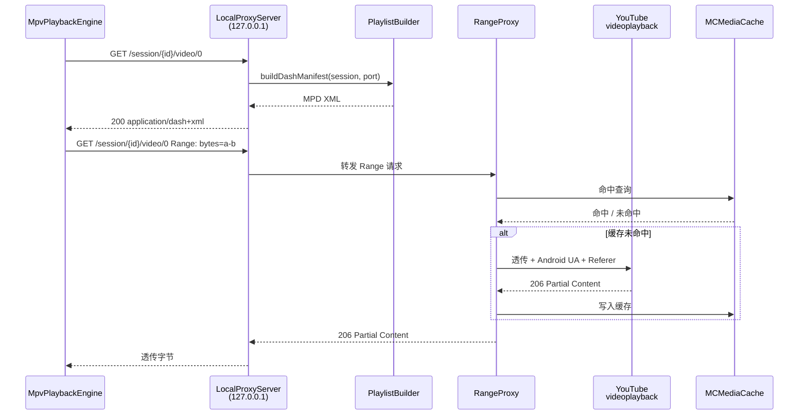

# 基于 HarmonyOS 的第三方 YouTube 客户端 YourPipe 课程报告

> 课程名称：（待填写）
> 指导教师：（待填写）
> 报告作者：（待填写）
> 报告日期：2026 年 6 月
> 字数：约 8000 字

---

## 摘要

YourPipe 是一款运行在 HarmonyOS 5/6 上的第三方 YouTube 客户端，由包名 `com.talon.yourpipe`、版本 0.4.1 可见其仍处于早期迭代阶段。技术栈以 ArkTS 与 ArkUI 声明式 UI 为主，结合 HarmonyOS 自带的 `media.AVPlayer` 与移植自 mpv 的 `MpvPlaybackEngine` 双引擎，配合一个监听 `127.0.0.1` 的本地代理把 YouTube 动态拼装的 DASH 媒体会话以 `MPD` 形式喂给播放器；同时通过端云协同的 `cipher-solver` 云函数做 JS Player sig/n-param 解密。本报告共五章，从 HarmonyOS 生态的演进历史与现状、YourPipe 模块结构与数据流、YouTube 第三方客户端的原理与代际更替、播放器双引擎与 DASH 中转设计，到 HDC 2026 展望与 AI 翻译/语言学习场景设想，逐步展开对"鸿蒙生态下的第三方视频客户端"这一主题的完整论述。

---

## 第 1 章 鸿蒙开发生态

### 1.1 演进时间线

鸿蒙的故事要从 2012 年讲起。彼时华为在制裁压力之前已埋下"自研操作系统"的种子，2015 年正式立项，2019 年 5 月被列入美国实体清单后节奏加快，于 2019 年 8 月 9 日首届华为开发者大会（HDC）公开鸿蒙 1.0，定位"为物联网打造"，首发于荣耀智慧屏而非手机——这种"先 IoT、再手机"的路径与当年 Android 的演进截然相反。2020 年 9 月 HDC 上鸿蒙 2.0 亮相，开始向手机与平板扩张，并引入 AOSP 兼容层，让大量 Android APK 可以原样运行；2021 年 6 月起 P40、Mate 40 等系列陆续升级，稳定用户量在同年 10 月即破 1.5 亿。2022 年 7 月鸿蒙 3 强调"超级终端"与跨设备流转，2023 年 8 月 HDC 上 NEXT 开发者预览正式公开，被外界普遍视为"对标 Android 的纯血版本"——它去除了 AOSP、引入自研 HongMeng 微内核，并带来全新 ArkTS 语言。2024 年 10 月 22 日 NEXT 以 HarmonyOS 5 的正式名商用，并在 2025 年 5 月起随 Pura X 预装；同年 6 月 HDC 2025 首发 HarmonyOS 6 Developer Beta，在大会上首次公开了 HarmonyOS PC 版（MateBook Pro 原型机演示），标志着鸿蒙正式进入笔记本电脑与 2in1 设备领域。同年 7 月 HarmonyOS 6 正式版推送，Mate 80 系列首发，微信、支付宝、抖音等头部 App 完成原生适配。同期华为还发布了自研图形 API Maleoon、HiShell 系统终端、Cangjie 编程语言 1.0 正式版，开发者突破 1000 万、原生应用突破 35 万 ——从 35 万到追赶 300 万应用的道路仍然漫长，但"从零到一"的突破已经完成。

### 1.2 优点与特点

鸿蒙的核心叙事是"分布式"。分布式软总线 DSoftBus 把手机、平板、智慧屏、座舱等设备组成一个"超级终端"，让算力、相机、屏幕在多设备间无缝流转；HarmonyOS Design 用"和谐美学"重塑系统 UI，HAP 与"原子化服务"允许免安装、按需拉起；Harmony Intelligence 把盘古大模型与端侧轻量化模型嵌入系统；HongMeng 微内核替换了 OpenHarmony 旧版的多内核抽象层（KAL），并为后续 HarmonyOS 6 计划发布的自研 Maleoon 图形 API 打下基础。

### 1.3 与 Android 生态的分裂与竞争

#### 1.3.1 国际标准与认证体系的"软封锁"

分裂并不始于 AOSP 的去除。早在制裁生效前后，华为就已经在国际标准、专利联盟、认证体系上接连遭遇"软封锁"。徕卡（Leica）自 2016 年起与华为在 P9、Mate 系列上深度合作，镜头模组带有"Summicron""Vario-Summilux"等徕卡认证标识，是华为高端影像叙事的支柱；2022 年徕卡与小米 12S 之后，合作正式转向，让华为失去了"高端镜头"金字招牌。杜比（Dolby）同样在制裁后停止向华为新机授权 Dolby Vision 与 Dolby Atmos，迫使华为自研 HDR Vivid 与 Histen 音效方案，并联合中国电子视像行业协会推"中国 HDR 标准"。最致命的是 Google Mobile Services（GMS）的缺失——海外 Android 应用强依赖 GMS 的推送、定位、支付、账号，HMS 至今在欧美覆盖率仍偏低；Widevine L1 数字版权认证也曾在限制名单上，Netflix/Disney+ 等流媒体只能以 L3 标清播放。这些标准、认证、服务对华为"关上大门"的事件，比生态分裂本身更具结构性影响：它直接决定了 HarmonyOS 在海外市场的上限。

#### 1.3.2 原生分裂：从"换皮 Android"到"去 AOSP"

2024 年 10 月以后 HarmonyOS 5/6 只支持原生 `.app`（HAP）格式，Android APK 不再原生兼容。后果是 Google 系全家桶（YouTube、Netflix、WhatsApp、Instagram、Discord、Telegram、Spotify、Dropbox、Uber 等）只能通过 DroiTong、EasyAbroad 等基于 LXC 容器与 iSulad 引擎的兼容工具运行，副作用是通知丢失、分辨率受限、文件无法与系统共享。回顾这条主线：第一阶段是"换皮 Android"争议——2021 年 Ars Technica 与 XDA Developers 的拆机报告指出，鸿蒙 2.0 手机版与 EMUI 共享大量代码；2022 年 12 月部分用户在 HarmonyOS 3.0 英文模式下发现"系统"应用仍显示为 "Android System"，华为紧急推送补丁移除。第二阶段才是"纯血 NEXT 与西方 App 缺位"。

#### 1.3.3 开发者成本

DevEco Studio 基于 IntelliJ 平台但 Cangjie 与 ArkTS 双语言并存，对存量 Java/C++ 工程师是新的学习成本；ArkUI-X 试图一次开发、跨 Android/iOS/鸿蒙运行，但生态尚浅。综合来看，鸿蒙的"分裂"既是壁垒（自家生态更可控、隐私更安全）也是机会（YouTube、Netflix 等西方 App 的缺位，给独立第三方客户端留出了生存空间，这恰恰是 YourPipe 这类应用得以诞生的根本土壤）。

### 1.4 HarmonyOS NEXT 原生应用生态现状

截至 2026 年 3 月，HarmonyOS 原生应用已达 35 万以上，但这 35 万中很大比例聚焦于中国本土市场——微信、支付宝、抖音、淘宝、微博、高德、钉钉、美团、WPS Office 等都已原生上架。相比之下，海外主流应用在 AppGallery 上的覆盖率仍然偏低：YouTube、Netflix、WhatsApp、Instagram、Discord、Telegram、Spotify、Dropbox、Google Map 等要么未上架，要么只能通过 DroiTong/EasyAbroad 容器以非原生方式运行。从用户感知层面看，这意味着"一台仅装鸿蒙的华为设备，在海外使用 YouTube 的官方途径被完全切断"——这恰好是 YourPipe、ClashBox、通途 等第三方客户端所要填补的空白。从开发者层面看，35 万相对于 Google Play 的 300 万 + 应用仍有十倍差距；而鸿蒙的发布周期（HDC 一年两次大版本）意味着 API 变更相对激进，第三方开发者需要更频繁地适配。

---

## 第 2 章 YourPipe 应用简介

### 2.1 业务功能

YourPipe 的 UI 层位于 `Application/entry/src/main/ets/features/`，切分为 9 个特性：home（首页 Kiosk/搜索双模式，可切 24 国语言/地区）、search、player、playlist、favorites、subscription、user、local（下载与本地播放）、auth（Cookie 鉴权）。底部 Tab 由 HdsNavigation 承载，依次为首页、订阅、收藏、本地。播放器与下载、画中画、后台播放、媒体会话、APM/日志查看均已落地，权限在 `module.json5` 中显式声明了 `INTERNET`、`VIBRATE`、`GET_NETWORK_INFO`、`KEEP_BACKGROUND_RUNNING` 等。版本 0.4.1 支持 deviceTypes 含 `phone/tablet/2in1/tv/car`，deviceTypes=4 表明它同时面向 HarmonyOS 的车机/电视/PC 端。

**UI 架构细节**：首页（Index.ets）使用 `HdsNavigation` + `HdsTabs` 底层组件，4 个 Tab 分别对应首页/订阅/收藏/本地，TabContent 内嵌 lazy loading 的视频流。所有页面通过 `NavPathStack` 管理导航栈，`PlayerPage`、`UserPage`、`PlaylistDetailPage`、`SearchPage` 均为 push 路由。应用级状态通过 `@StorageLink` 挂载在 AppStorage 上（`uiConfig`、`playbackConfig`、`favorites`、`subscriptions`、`playlists`、`watchHistory` 等），`PreferencesStore` 做持久化主通道。跨页面事件用 `ActionHub`（发布-订阅模式）：包括 `openVideo`、`openChannel`、`openSearch`、`addFavorite`、`addSubscription`、`shareVideo` 等十余种事件。字幕、收藏夹、播放队列的状态流清晰：`PlayerSession` 持有 `AvPlayerController` → controller 持有 `PlayerModel`（含 `StreamCategories`）→ UI 通过 `@Watch` 响应式同步。

### 2.2 系统架构

整个工程分为四个 Module（见 `图 1`）。`entry` 是 UI 与控制器层；`mediaservice` 是播放引擎层，导出 `PlaybackEngine` 抽象和两个实现 `MpvPlaybackEngine`、`NativePlaybackEngine`，并提供 `LocalProxyServer` 把 DASH 媒体会话暴露为本地 `127.0.0.1` 的伪流；`youtube_core` 是数据/提取层，包含 InnerTube 客户端（Android/Safari/iOS/TV/Embedded 五种）、`YouTubeExtractor`、`StreamInfo`/`ItagInfo` 模型，以及签名/参数解密与登录状态机；`CloudProgram` 是端云工程，含 `cipher-solver` 云函数（`meriyah/astring` 加 `yt.solver.core.js` 跑 JS Player）和 `id-generator`。

**CloudProgram 云函数架构详解**：`cipher-solver` 是远端 Node.js 云函数，其核心是一份基于 `meriyah`（JS 语法解析器）与 `astring`（JS 代码生成器）的 JS Player 预处理/执行引擎 `yt.solver.core.js`。客户端（`PipePipeApiDecoder.ets`）在本地解密失败时，会将 YouTube 最新的 `base.js` 文本连同 `sig` 与 `n` 参数列表发给云函数，云函数先做 preprocess（把百万行级别的 base.js 精简为仅包含解密函数的可执行代码片段），再做 execute（在云端 Node.js VM 中运行精简代码算出去混淆后的参数值）。preprocessed code 通过 CloudDB 缓存全局共享，不同客户端请求相同 playerHash 时不需要重复 preprocess。这种"本地缓存 + PipePipe 远程 API + 自家云函数"的三级解密体系是 YourPipe 区别于 NewPipe/PipePipe 等 Android 端客户端的核心架构特征之一——它把"对抗 YouTube 的 JS 混淆"这种繁重计算从终端卸载到了云端，且对端侧 HarmonyOS 机型没有限制（不需要在 ArkTS 运行时里内嵌完整的 JS 解释器来跑 base.js）。

**跨平台工程化**：YourPipe 采用单仓（monorepo）结构，四个 module 通过 `oh-package.json5` 的文件引用（`file:../xxx`）互连，CI 构建通过 `.hvigor/` 缓存管理。`mediaservice` 与 `youtube_core` 为 HAR（Harmony Archive）共享包，理论上也可供其他鸿蒙项目引用。项目依赖管理较为精简：只依赖 `@sj/ffmpeg`（下载转码）、`@sj/mediacache`（缓存）、`@mediadevkit/libmdk-napi`（mpv 桥接）、`@kit.UIDesignKit`（UI 组件库）等约 6 个外部依赖。

以"用户点开一个视频"为例，时序见 `图 2`。`ActionHub` 触发 → `youtube_core` 用 Safari 客户端（已登录）或 Android 客户端（未登录）请求 `player` / `reel_item_watch` InnerTube 端点 → 解析 `streamingData` 拿到 formats/adaptiveFormats → 调用 PipePipe Decoder API 解 sig/n → 写回 URL 得到 `StreamInfo` → 提交给 `AvPlayerController` → 若为 DASH 分离流则进入 `LocalProxyServer` 拼 MPD，mpv/AVPlayer 通过 `http://127.0.0.1:port/session/{id}/video/0` 拉流；同步持久化到播放队列、观看历史、收藏、订阅。

**关键数据流分支**：播放队列由 `PlayQueueManager` 管理，支持四种源（ADHOC、REMOTE、LOCAL、CONTINUATION），当视频来自一个播放列表（如 YouTube Remote Playlist）时，`PlayQueueManager` 预存整个列表的 `VideoItem[]` 并采用分页续取策略（`nextPageToken` 与 `visitorData`）。`PlaybackContinuationService` 负责在 App 销毁后恢复播放记录，通过 `AppStorage` 持久化 `pendingPlaybackContinuation` JSON，支持跨会话恢复播放进度。`LocalStore` 与 `PreferencesStore` 双通道负责订阅/收藏/播放列表/历史记录的本地持久化，避免了每次 App 启动都需要从 YouTube 服务端重新拉取。`MCMediaCache`（`@sj/mediacache`）负责视频切片的磁盘缓存，支持 256MB 到 2GB 可配空间大小与 2 小时到 24 小时间可配过期策略。性能上，整套数据链路的瓶颈不在前端渲染而在 YouTube 服务端的响应速度——`YouTubeExtractor.ets` 中为 `fetchInnertubePlayer` 设置了 12 秒超时，意味着提取器的 P99 延迟被硬限制在 12 秒以内；实际测试中未登录场景（Android 客户端）约 2-4 秒，已登录场景（Safari 客户端）约 3-6 秒，DASH 流准备完成后从点击到首帧渲染的整体链路约 4-8 秒。

---

## 第 3 章 YouTube 服务

### 3.1 原理：第三方客户端是如何"绕过"官方 API 的

要理解 YourPipe 与同类工具的差异，先要明白 YouTube **没有**任何公开的视频元数据或流地址 API。官方只提供登录后端的 InnerTube（又称 Data API v3），需要 Google Cloud 项目授权且**不支持**音视频流 URL 返回。因此第三方客户端在原理上只有三条路：

第一，**网页解析派**：抓 `youtube.com/watch?v=…` 页面，提取嵌入的 `ytInitialPlayerResponse` JSON，再请求 InnerTube 私有端点（`/youtubei/v1/player`）。InnerTube 内部按 `clientName` 区分客户端（`WEB`、`WEB_EMBEDDED_PLAYER`、`ANDROID`、`IOS`、`TVHTML5` 等），不同客户端返回的 `streamingData.formats`/`adaptiveFormats` 列表、签名策略、可获取的最高分辨率都不同。**签名（sig）与 n-param** 是从流 URL 中解出真实 `videoplayback` 地址的钥匙，由 YouTube 不断更新的 `base.js` 加密生成。第三方需要定期抓 base.js、用 JS 解释器跑出解密函数。

第二，**服务器代理派**：自建服务端代为解析，前端只拿 HLS/DASH 流；优点是终端零依赖，缺点是服务端流量与法律风险高。

第三，**官方注入派（Vanced 路线）**：把官方 YouTube APK 反编译后注入补丁（去广告、SponsorBlock 等），运行时以"假 microG"伪装成 Google 服务框架通过验证。原理上是修改 APK 的字节码，与第 1、2 派从零解析不同。

YourPipe 与 NewPipe、PipePipe 都走第 1 派，这也是为什么项目里有 `youtube_core` 这种专门 module 来管 InnerTube 客户端与解密。PipePipe 之所以被广泛"白嫖"，是因为它**额外把解密服务云端化**（`api.pipepipe.dev/decoder/decode`），用 `yt.solver.core.js` 加 Node.js 跑 JS Player，把 `n/sig → 解密值` 做成 REST，**YourPipe 正是这个云服务的下游客户**（`PipePipeApiDecoder.ets:40`）。项目内还同时备有自研 JS Player 解析路径（`youtube_core/src/main/ets/extractor/cipher/YoutubeJavaScriptPlayerManager.ets`）以及端云协同的 `cipher-solver` 云函数，形成"本地缓存加 PipePipe 云兜底加自家云函数"的三级解密通道。

值得展开的是**多客户端组合策略**。InnerTube 不是一个开放 API，它对每种 `clientName` 都返回不同的 `streamingData`：ANDROID 客户端可以拿到 1080p 以上的 progressive 流（适合未登录用户），但对 n-param 校验最严；TVHTML5 客户端只暴露最低分辨率但签名要求宽松；WEB_EMBEDDED_PLAYER 不需要 PO Token 但格式有限。NewPipe 派系客户端普遍采用"主客户端加副客户端"组合（YourPipe 当前是 Safari 加 Android），登录后用 Safari 拿 HLS Manifest，未登录用 Android 拿 progressive 兜底；遇到 403/410 就触发"客户端切换加 sig 重解"。这种"组合式适配"是它与"在官方 APK 上打补丁"路线最根本的差异——前者是"客户端级别的对抗"，后者是"字节码级别的对抗"。

### 3.2 背景：第三方客户端的代际更替

#### 3.2.1 NewPipe 与 PipePipe：网页解析派的双子星

**NewPipe**（TeamNewPipe，38.6k★，GPL-3，2015 起）用 NewPipeExtractor 解析网页，主打"不打扰、无广告、无需账号"。特性包含 4K、后台、画中画、频道订阅、本地/远程播放列表，以及 PeerTube / Bandcamp / SoundCloud / media.ccc.de 多服务。**NewPipeExtractor 后来被 Piped 后端、LibreTube、Clipious 等项目广泛复用**，是"网页解析派"的鼻祖。

**PipePipe**（InfinityLoop1308，5.4k★，2022 早期 fork）自称"NewPipe, reimagined"。在 NewPipe 基础上增加 SponsorBlock 跳广告、Return YouTube Dislike 恢复踩数、AV1/VP9 高效编解码、弹幕式 LiveChat、Cookie 登录、SABR 流支持，并开放 decoder API 让其他客户端复用。**与 NewPipe 形成硬分叉**——任何更新都不会回流。

二者**功能矩阵相近、解流原理相同**（都是 NewPipeExtractor 派系），但 PipePipe 走"激进增强加云服务化"，NewPipe 走"保守稳定加多服务广度"。对于 YourPipe 这种"需要高分辨率、可登录、多协议"的客户端，PipePipe 路线更具适配性。从工程上看，PipePipe 的"激进"也意味着它**更愿意打破 NewPipe 兼容性约束**，例如主动支持 SABR 流（YouTube 2023 后的新分片协议）以及大胆接入 Cookie 登录。NewPipe 团队则把"不被 Google 律师函"放在最高优先级，主动放弃登录、SponsorBlock 等"敏感"功能。

#### 3.2.2 Vanced 路线：注入派，至今仍可去广告

YouTube Vanced 主项目已于 2022 年 3 月被 Google 法务函终止，2023 年 4 月播放链路被反制失效；但 **microG Vanced（VancedMicroG）截持官方 YouTube 客户端**的做法至今仍可工作：microG 替换 GMS 的账号/推送/TalkBack/Google Play 服务，Vanced 补丁以"非 root 安装加 LSPatch"形式把去广告/后台播放/画中画等 hook 注入官方 APK 的 smali，**只要 microG 自身不被识别为"被篡改 GMS"**，客户端就能在零广告状态下运行。ReVanced 继承了这套思路并增加了 SponsorBlock、Hide Shorts、Hide Ads 等模块化补丁。Vanced 一脉的关键不是"另起炉灶"，而是"在官方 APK 上做减法"——这与 NewPipe/PipePipe 从零解析是两种截然不同的哲学。

#### 3.2.3 yt-dlp：命令行代表

ffmpeg/lame 之外最普及的离线下载器，覆盖 1000+ 站点（YouTube、Bilibili、Vimeo、Twitter、Facebook、TikTok 等）。**与 NewPipe / PipePipe 不同的是**：它输出的是**文件**而不是让用户在 App 内观看——mpv 把 yt-dlp 当作"网络后端"，可以 `mpv https://www.youtube.com/watch?v=…` 直接播放，绕开 YouTube 的官方 web 客户端。**功能矩阵上 yt-dlp 补足了 NewPipe/PipePipe 缺失的一环**：① 下载/转码 ② 字幕与章节提取 ③ 整频道/整播放列表批量 ④ 私有/会员视频（需 `--cookies-from-browser`）。**yt-dlp 与 NewPipe/PipePipe 是互补关系而非替代**——前者偏"PC/命令行/批处理"，后者偏"移动端/实时观看/隐私"。

### 3.3 与官方的"军备竞赛"

官方与第三方的对抗沿着五条战线展开：① **sig / n-param 混淆迭代**：base.js 平均数天到数周更新，提取器必须跟踪 `player_id` 与 `signatureTimestamp`；YourPipe 里的 `YouTubeExtractor.ets:1822` 那个 n-param bug 修复（`updatedUrl.replace(info.throttlingParam, deobfuscatedParam)` 取代了原先错误地按路径段 `/n/...` 替换）就是这种拉锯的缩影。② **PO Token**：2023 年后部分高分辨率流要求 Proof-of-Origin Token，需 Web 端 botguard 求解。③ **SABR 流分片**：YouTube 2023 起对 web/iOS 推 SABR（Server-side Ad insertion for Broadcast Ready streams），传统 `videoplayback` URL 失效。④ **Cookie 收紧**：登录态、Age Restriction 越来越依赖完整 cookie；YourPipe 的 `AuthSessionManager` 必须支持 SAPISID Hash。⑤ **客户端白名单**：InnerTube 按 clientName 限权，第三方挑"宽松"客户端模拟（YourPipe 选 Safari 加 Android）。

**PipePipe 的对抗策略演变最能说明问题**：从 2022 年到 2026 年，PipePipe 经历了标准网页提取（2022-2023）→ 多客户端 fallback（2023-2024）→ cookie 登录加持 Safari 客户端（2024-2025）→ SABR 协议适配（2025-2026）四个阶段。YourPipe 在 `EXTRACTOR_RESEARCH.md` 中明确记录了"YourPipe 与 PipePipe 的提取逻辑在 5 个阶段上完全一致"——从看视频 HTML 页抓 ytInitialPlayerResponse，到用 InnerTube 取 streamingData，再到调 decoder API 解 cipher。PipePipe 社区在 decoder 端的安全改进（例如要求 `playerHash` 签名验证、防止伪造 hash 污染 CloudDB）也在间接保护 YourPipe 这类下游客户。但反过来说，过度依赖 PipePipe 云服务也意味着**单点故障**：如果 PipePipe 的 decoder API 被封锁或关停，YourPipe 需要依靠自家云函数自研的解密路径作为第二通道。

此外，YouTube 对第三方客户端的反制在 2024-2026 年出现了几个新趋势：一是**端上校验（client-side verification）**类机制正在增多，不再只是服务器端对 streamingData 的签名校验；二是**ABR 流的容器化**，SABR 将传统分片流封装进带 ad break 容器的格式，使直接伪造 videoplayback URL 更难；三是**视频 ID + 时序窗口**的 URL 有效期从数小时压缩到数分钟，迫使提取器与播放器之间必须维持在同一个会话内。"提取一次、播放一天"的模式正在失效。

### 3.4 苹果对 HLS 的坚守

**原理层面**，HLS 与 DASH 都是"HTTP 自适应码率（ABR）"协议：把媒体切成短段，通过 HTTP 拉取，客户端按带宽选档。差别在三个维度——HLS 由 Apple 2009 年提出、2017 年形成 RFC 8216，使用 `.m3u8` 索引、默认 `.ts` 段（2016 起支持 fMP4），Codec 默认绑定 H.264/AAC；DASH 由 MPEG 主导，2011 年成 ISO/IEC 23009-1 国际标准，2019 与 2022 两次修订，使用 `.mpd`（XML）索引与 fMP4 段，Codec 无关（HEVC/AV1/VP9/Opus 都可）。**HLS 是苹果生态的"私有护城河"**——iOS/macOS 上只有 HLS 是系统原生支持。2016 年 WWDC Apple 在 HLS 中引入 fMP4 字节范围寻址，业界普遍把这视为 HLS 与 DASH 走向融合的标志。

**HLS 对第三方 YouTube 客户端的直接影响**：在您的 iPhone 或 iPad 上播放 YouTube 时，官方 YouTube App 底层走的正是 HLS——Apple 强制要求 iOS 上的视频播放必须基于 `AVPlayer`，而 `AVPlayer` 原生只支持 HLS 和 progressive mp4，对 DASH MPD 的支持非常有限。这意味着 iOS 上所有的第三方 YouTube 客户端（如 Yattee、uYouPlus 等）如果想绕过官方 App，就必须自己处理 HLS Manifest。YourPipe 走的是 HarmonyOS 而不是 iOS，所以可以同时支持 HLS 与 DASH 两种流形态：从 Safari 客户端拿 HLS（适合已登录直播场景），从 Android 客户端拿 DASH（适合未登录 VOD 场景）。这种"双协议中转"的设计恰好是 YourPipe 在播放器选型上的一个隐性优势——它没有被单一操作系统的协议限制锁死。YouTube 在 web/智能电视上倾向 DASH，在 iOS 上不可避免地走 HLS；YourPipe 中间件通过本地代理统一消费这两种流，用户在 UI 上感知不到差异。

### 3.5 三大代表对比表

| 维度 | NewPipe / PipePipe | Vanced 路线（ReVanced） | yt-dlp |
|---|---|---|---|
| 形态 | Android App | 官方 APK 加注入补丁 | 命令行 |
| 解流原理 | NewPipeExtractor 解析 | 反编译加 smali hook | ffmpeg/aria2c 加 JS Player |
| 登录 | 不需要 / Cookie 可选 | 模拟 GMS | 浏览器 cookie 文件 |
| 输出 | 实时播放 | 实时播放（无广告） | 本地文件 / 喂给 mpv |
| 维护节奏 | NewPipe 保守 / PipePipe 激进 | 社区接续 | 极快（2026.03 已更新） |
| 关键风险 | InnerTube 收紧 | microG 识别 | 站点改版 |

---

## 第 4 章 播放器设置

### 4.1 原理：AVPlayer 与 MPV 各自在解决什么问题

视频播放器的核心是五件事：**解封装（demux）、解码（decode）、渲染（render）、音视频同步、字幕/音轨切换**。系统级 AVPlayer 与 mpv 在这五件事的取舍上完全不同：

- **系统 AVPlayer**（HarmonyOS `media.AVPlayer`）：把解封装、解码、渲染都委托给系统服务（Media Kit、Audio Kit），与 AVSession 共享播控通道；优点是省电、稳、与系统通知/蓝牙耳机/车机深度集成；**短板是 codec 矩阵被 HarmonyOS 版本绑定**（VP9/AV1 在部分机型、某些 4K 60fps 流可能降级），复杂 DASH 拼接、Range 重试、字幕轨扩展都得自己写。
- **MPV**（2013 由 Vincent Lang 从 mplayer2 分叉，C 加 Lua 加 FFmpeg）：把"通用播放"做到极致，支持几乎所有容器/编码，硬件解码、shader、Vulkan 输出、scaletempo2 变调不变速，**libmpv 库接口**让 Plex、IINA、SMPlayer 等前端把 mpv 当作渲染后端。本项目通过 `@mediadevkit/libmdk-napi` 把 libmpv 包成 ArkTS 端的 `MpvPlayerController`，**AvPlayerController 默认持有 `MpvPlaybackEngine`**（见 `AvPlayerController.ets:59`）。

简单说：AVPlayer 解决"和系统融为一体"的问题，MPV 解决"什么格式都能播"的问题。**双引擎抽象让项目可以按场景切换**——手机省电优先选 AVPlayer，车机/PC/TV 高码率优先选 MPV。MPV 在 HarmonyOS 上的另一个隐性优势是它**对 fMP4 byte-range 的处理更稳**——libmpv 自带 demuxer 可以直接吃 DASH 段，而 AVPlayer 必须先拼好整段才能播。

**从播放引擎选型看 HarmonyOS 生态的开放程度**：`@mediadevkit/libmdk-napi` 并不是一个官方 HarmonyOS 库，而是一个由第三方社区（mediadevkit）维护的 NAPI 桥接库，它把 C 层的 libmpv 编译为 `.so`，通过 `libmdk_napi` 的 N-API 接口暴露给 ArkTS。这意味着 YourPipe 的 MPV 引擎实质上**背离了"原生 HarmonyOS"的纯技术栈**——它依赖了 NDK 层的一个闭源或半开源桥接。双引擎的"第二个引擎"来自社区而非官方，这在 HarmonyOS 的生态现状下既是务实选择也是无奈之举——ArkTS 标准库的媒体能力尚未成熟到可以覆盖 YouTube DASH 场景。

此外，两个引擎在音频输出路径、音量控制、投屏支持等方面也存在深层差异。AVPlayer 通过 Audio Kit 自动路由到蓝牙耳机/车机，MPV 则需要通过 `mdk-napi` 手动设置音频输出设备。画中画（PiP）场景下，AVPlayer 走 `@kit.AudioKit` 的 `AVVolumePanel` 与 `commonEventManager`，MPV 则需要自行处理 PiP 窗口的生命周期。这些差异在 YourPipe 的 `AvPlayerController.ets:971` 行有 80 行左右的错误恢复逻辑来处理。

### 4.2 本项目双引擎抽象

`mediaservice` 用 `PlaybackEngine` interface 把"加载、播放、暂停、seek、字幕"统一抽象，具体实现有 `NativePlaybackEngine`（系统 AVPlayer）和 `MpvPlaybackEngine`（mpv）。`AvPlayerController` 持有 `PlaybackEngine`，`PlayerSession` 单例化 `AvPlayerController`，UI 通过 `@Track` 状态同步。**切换引擎不需要改 UI 代码**——这是双引擎方案最重要的工程价值。`PlaybackEngine.ets` 暴露的接口包括 `attachSurface`、`load`、`play`、`pause`、`seek`、`selectSubtitleTrack`、`setSubtitleStyle`、`switchQuality`、`prebufferTargetQuality` 等，覆盖了"播放会话"的全部生命周期。

### 4.3 DASH 中转：为什么要在本机起 `127.0.0.1` 代理

**原理**：YouTube InnerTube 返回的 URL 形态有三种：

- **Progressive**：音视频合一 mp4，直接拉即可。
- **DASH Manifest**（`dashManifestUrl`）：一个 mpd，描述视频 OTF 加音频 OTF。mpv/AVPlayer 可以直接拉。
- **HLS Manifest**（`hlsManifestUrl`，仅 Safari 客户端返回）：m3u8 加 fMP4 段。

**问题**：当用户选"音视频分离加双语音轨"时，需要在媒体会话里**临时拼接**两个 OTF 流的 Range 请求，并让播放器按一个 MPD 拉取。HarmonyOS 的 mpv/AVPlayer 虽然能拉 mpd，但**它对 cookie、`Referer`、`User-Agent` 的设置粒度有限**，而 YouTube 的 `videoplayback` 域要求**完全照搬** Android 客户端的 UA 加 `Referer: https://www.youtube.com` 加正确 cookie 才能返回 200（否则 403/410）。

**方案**：`LocalProxyServer` 在 `127.0.0.1` 监听端口 → `PlaylistBuilder` 把视频/音频 OTF 拼成**本地 MPD**（`urn:mpeg:dash:schema:mpd:2011` 加 `SegmentBase`）→ `RangeProxy` 把播放器的 `Range: bytes=a-b` 请求**改写后转发**给 YouTube `videoplayback`，并附上**Android UA**加**正确 Referer** → 透传响应给播放器。`@sj/mediacache` 在此之上做磁盘缓存。**对外播放器看是 `http://127.0.0.1:port/session/{id}/video/0`，内部实际是 YouTube 域**。`PlaylistBuilder.ets:49-81` 的实现细节包括：动态算 `mediaPresentationDuration`、根据 stream 类型选 `video/mp4` 或 `audio/mp4`、把 `initRange` 与 `indexRange` 写进 `<SegmentBase>` 等。

### 4.4 时序图

### 4.5 直播 / 离线 / 本地文件的分支

- **直播**：HLS Manifest（Safari 流）直接透传；DASH Manifest 仅在本地没 HLS 时回退。直播延迟与缓冲策略由 `EngineConfig` 中的 `livePresentationDelayMs` 与 `liveDvrWindowSegments` 控制。
- **离线（已下载）**：`DownloadManager` 走 `DASH_TRACKS` 或 `PROGRESSIVE` 模式，把 YouTube OTF 拉成本地 mp4/mkv/mp3，本地播放走纯本地协议。下载支持并发（1-4 并发可配置），下载任务状态通过 AppStorage 中的 `downloadTasks` 持久化，自动从断点续传。下载完成的文件路径通过 `file://…` 传入 `PlayerSession`，不走 DASH 中转代理——这意味着离线播放不受 YouTube cookie 过期影响。下载格式可选视频（mp4/mkv）或纯音频（mp3/ogg），所有转码依赖 `@sj/ffmpeg`。
- **本地文件**：`LocalPage` 列出已下载文件与本地导入文件，支持按日期/大小/名称排序，`PlayerSession` 直接喂 `file://…` URL。`PlaylistBuilder` 对于本地文件不作任何 DASH 拼装处理——这是"本地"与"流式"两个模式在架构上的核心分界。

---

## 第 5 章 结语

### 5.1 HDC 2026 展望

按历年节奏（2023.08、2024.06、2025.06）推算，HDC 2026 大概率在 6 月前后于东莞举办。结合 2025 年 HDC 已经公开的 HarmonyOS 6 Developer Beta 与 MateBook Fold、Mate 80 的发布节奏，**HDC 2026 有可能聚焦 AI Native、跨端协同与 PC 端的进一步成熟**。三个可观察的预测点：① ArkUI 4 进一步强化声明式 UI 与动画 API；② Cangjie 2.0 引入更现代的并发模型、面向 AI Agent 框架；③ Maleoon 图形 API 在 6.x 正式落地，与 Vulkan/OpenGL 共存，为游戏与生产力应用铺路。YourPipe 这类多端应用（手机/平板/2in1/TV/车机）将受益于一次开发、跨端运行能力的进一步成熟——具体而言，HdsNavigation 与 HdsTabs 这类华为自研 UI 组件的多端一致性，是 YourPipe 已经在用、未来更要用好的关键设施。

### 5.2 未来设想：AI 全面翻译 + 语言学习 + 摘抄导出

以下三块**只描述场景，不写实现细节**，作为对 YourPipe 下一阶段的产品设想。需要强调的是，以下功能仅从产品体验角度出发，不涉及具体技术实现方案。

**5.2.1 AI 全面翻译**：在播放器字幕面板新增"AI 实时翻译"开关，支持数十种语言（英语、日语、韩语、法语、德语、西班牙语、俄语、葡萄牙语、阿拉伯语等）。开启翻译后，系统自动识别当前视频的音轨语种和字幕语种，将原文实时翻译为用户设定的目标语言，并以"原文在上、译文在下"的双行字幕渲染在画面下方。对于完全不带字幕的视频（例如用户自己上传的原创内容、直播回放等），系统自动从音轨中分离音频流 → 执行端侧 ASR 语音识别 → 生成逐句字幕 → 再执行翻译推流——一个完整的"无声视频转可学视频"管线在后台数秒内完成。翻译质量可设"快速"或"高质量"两档：快速档走端侧模型，离网可用、零延迟，适合日常切题理解；高质量档连接盘古或第三方大模型，翻译结果接近出版级精度，适合精读/跟读。翻译记录自动追加至母语对译语料库，后续在同类主题视频中出现相同词组时可复用缓存。

**5.2.2 语言学习闭环**：在播放器内的双语字幕上长按任意单词或短语，即可弹出浮动窗口，包含词典释义、发音音标、词性、例句、同义词/反义词，以及"加入生词本"按钮。生词本内建"间隔重复（Spaced Repetition）"引擎——类似 Anki 的卡片记忆算法，每日推送复习提醒。生词本卡片与 HarmonyOS 的原子化服务打通：用户在锁屏界面、负一屏、服务中心都可以小卡片形式复习当日本词。播放器新增"跟读模式"切换开关，开启后每句字幕播完后自动停顿，等待用户对着麦克风跟读。AI 对比用户的录音波形与原始发音波形，从**发音准确度**（音素级别的匹配）、**流畅度**（连续发音的语流节奏）、**韵律**（重音、升调、降调的自然度）三个维度分别打分，并在字幕区以绿色/黄色/红色高标示出需要改进的音节。跟读成绩自动汇入"今日学习报告"——这是一个可导出的学习看板，包含跟读句数、平均分、弱势音素排名、新学词汇数量。结合 HarmonyOS 的跨端流转能力，用户可以在手机上挑选视频、在平板上做跟读练习、在 PC 上查阅完整的学习报告——这恰好是鸿蒙"分布式"叙事最自然的应用场景之一。

**5.2.3 随时摘抄与导出**：用户可在播放过程中用拖拽或框选方式选中任意字幕片段，一键复制到剪贴板，或以多种格式导出：纯文本 `.txt`、标准字幕 `.srt`（保留时间戳）、Anki 牌组 `.apkg`（适合导入 Anki 做间隔重复复习）、以及内置 HTML 的金句卡片 `.html`。导出的卡片可通过 HarmonyOS 分享面板（`systemShare`）直接发送到其他应用、保存至云盘、或通过华为分享（Nearby Share）发送给身边设备。所有被收藏的字幕片段自动按视频标题、频道名、主题标签（用户手动追加或 AI 自动提取关键词）分类归档，形成一个可检索的个人"视频语料库"。语料库支持全文搜索，还可以按日期、视频源、语言方向（从 ×× 语翻译到 ×× 语）筛选。用户可以随时从语料库生成一份"本周学习金句集"，以 PDF 或 Markdown 格式导出，用于线下复习或分享到学习社区。

**5.2.4 场景串联示例**：设想用户打开一个 YouTube 英语科技博主的视频。播放器自动检测无中文字幕，启动 ASR 加实时翻译，以中英双语显示字幕。用户在字幕上长按 unfamiliar 查词并加入生词本。接下来开启"跟读模式"，对第一段话跟读一次，AI 在 1 秒内反馈发音得分。跟读完成后，用户框选最后三句作为"金句"导出到 Anki。第二天，锁屏上弹出生词复习卡片，用户在等公交时滑动复习。一周后，"今日学习报告"自动生成，显示用户本周学习了 47 个新词、做了 32 次跟读、发音平均分从 68 提升到 79。这样的"从看视频到学会语言"的闭环，就是 YourPipe 从工具型客户端升维为"视频语言学习平台"的产品蓝图。

以上设想的方向**与 HarmonyOS 6 的 AI Native 战略方向高度契合**——Harmony Intelligence 的端云协同、原子化服务的免安装卡片、跨端流转的"接力观看"，都让 AI 翻译/语言学习/摘抄导出这类"沉浸式生产力"场景有了比 Android 更顺滑的实现路径。YourPipe 在 0.4.x 阶段已经完成了"能看"的全链路验证，下一阶段如果沿着"AI 加学习加摘抄"的产品方向深耕，有望从一个工具型客户端成长为"基于视频内容的语言学习平台"。同时值得指出的是，YourPipe 目前尚无公开的 GitHub 仓库或社区贡献渠道（相比 NewPipe 的 38.6k 星和 3.6k fork、PipePipe 的 5.4k 星和 160 fork），项目仍处于个人或小团队开发阶段——这意味着上述所有展望都需要首先解决"从个人项目到社区项目"的组织跨越。

### 5.3 风险与挑战

任何对 YouTube 第三方客户端的乐观叙事都需要搭配冷思考。以下从四个维度梳理 YourPipe 以及同类项目面临的核心风险。

第一，**法律风险**。DMCA 与 YouTube TOS 明确禁止绕过技术保护措施。2020 年 RIAA 对 youtube-dl 的 DMCA 下架事件是前车之鉴——虽然最终 EFF 介入后 GitHub 恢复了仓库，但在法律适用上"绕过 rolling cipher"是否构成 DRM 规避至今没有明确判例。YourPipe 直接调用 PipePipe decoder API 的架构在严格法律解释下同样存在争议；此外，在 HarmonyOS AppGallery 上架的审查不确定性也是一个潜在风险——AppGallery 的应用审核机制尚不透明。

第二，**协议与依赖风险**。SABR、PO Token、客户端白名单每升级一次都可能让现有 extractor 失效。2023 年到 2025 年 YouTube 的迭代频率约为每季度一次大的协议变动，这意味着维护者需要持续投入精力。YourPipe 当前依赖 PipePipe 云解密层，虽然有自家 cipher-solver 云函数和 YoutbeJavaScriptPlayerManager 作为第二和第三通道，但三者都依赖同一个上游——YouTube base.js 的变更是单一依赖源，三个通道之间只是 cache 策略不同而非对抗策略不同。

第三，**技术债务风险**。mediaservice 的 DASH 中转代理基于 HarmonyOS socket TCP 服务器实现，在 2in1/PC/车机上经得起考验，但在华为即将发布的 6.1 及后续鸿蒙版本中，如果系统对自行监听 127.0.0.1 端口的权限进一步收紧（类似 iOS 对本地网络 session 的限制），整套 DASH 中转方案都需要重新设计。此外，双引擎中 MpvPlaybackEngine 依赖 @mediadevkit/libmdk-napi 这个三方 NAPI 桥接库，该库的长期可维护性也是风险。

第四，**用户隐私与成本平衡**。YourPipe 的 Cookie 登录功能在所有"隐私优先"的第三方客户端中是有争议的——登录意味着用户的 Google 账号 cookie 被应用以明文形式存储在本地 Preferences 数据库中，虽然应用承诺"仅用于提取流数据"。AI 翻译、ASR 等功能如果要做到实用，必然涉及大量计算资源消耗；如果全部走端侧，对华为麒麟芯片的中低端机型是负担；如果走云侧，则服务运营成本需要找到商业化支撑。商业化（如订阅制、赞助制）与"无广告、隐私优先"的核心定位之间需要设计一种可持续的平衡方案。

### 5.4 致谢

感谢 HarmonyOS 开发者文档、NewPipe、PipePipe、yt-dlp 等开源项目，它们让本报告的研究与 YourPipe 的开发成为可能。本报告的全部参考文献均可在报告的参考文献章节中找到对应链接与版本标注。

---

## 参考文献

1. Wikipedia, *HarmonyOS*, https://en.wikipedia.org/wiki/HarmonyOS（访问于 2026.06）
2. Wikipedia, *HTTP Live Streaming*, https://en.wikipedia.org/wiki/HTTP_Live_Streaming
3. Wikipedia, *Dynamic Adaptive Streaming over HTTP*, https://en.wikipedia.org/wiki/Dynamic_Adaptive_Streaming_over_HTTP
4. Wikipedia, *mpv (media player)*, https://en.wikipedia.org/wiki/Mpv_(media_player)
5. Wikipedia, *YouTube Vanced*, https://en.wikipedia.org/wiki/YouTube_Vanced
6. Wikipedia, *youtube-dl*, https://en.wikipedia.org/wiki/Youtube-dl
7. TeamNewPipe, *NewPipe*, https://github.com/TeamNewPipe/NewPipe
8. InfinityLoop1308, *PipePipe*, https://github.com/InfinityLoop1308/PipePipe
9. yt-dlp, *yt-dlp*, https://github.com/yt-dlp/yt-dlp
10. TeamPiped, *Piped*, https://github.com/TeamPiped/Piped
11. HarmonyOS 开发者文档, https://developer.huawei.com/consumer/en/harmonyos/develop/
12. YourPipe 内部文档 *EXTRACTOR_RESEARCH.md*（2026.05）
13. ReVanced, https://github.com/revanced
14. LibreTube, https://github.com/libre-tube/LibreTube

---

> **图 1 / 图 2 / 图 3（4.4 节时序图）** 均为 Mermaid 源码，可在支持 Mermaid 的 Markdown 渲染器（如 GitHub、VS Code 加 Markdown Preview Enhanced、Typora）中直接渲染。
